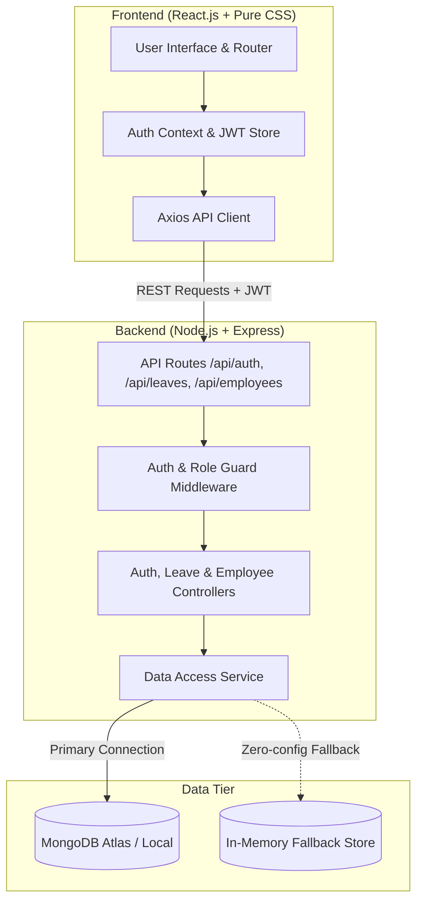

# LeaveFlow - Leave Management System (MERN Stack)

[](https://nodejs.org/)
[](https://reactjs.org/)
[](https://www.mongodb.com/)
[](https://jwt.io/)
[](https://www.w3.org/Style/CSS/)

LeaveFlow is a complete, production-ready **Leave Management System** built with the **MERN Stack** (MongoDB, Express.js, React.js, Node.js), JSON Web Tokens (JWT), and crafted with **pure custom CSS** (zero bloated UI dependencies).

The design strictly matches the professional layout, typography, status badges, and UX specified in the design specification.

---

## 📑 Table of Contents
1. [Project Overview](#-project-overview)
2. [Key Features](#-key-features)
3. [Architecture & System Design](#-architecture--system-design)
4. [Tech Stack](#-tech-stack)
5. [Demo Credentials](#-demo-credentials)
6. [Local Setup Instructions](#-local-setup-instructions)
7. [Environment Variables](#-environment-variables)
8. [API Documentation](#-api-documentation)
9. [Deployment Guide (Vercel & Render)](#-deployment-guide)
10. [Submission Checklist](#-submission-checklist)

---

## 🌟 Project Overview
LeaveFlow automates and streamlines the employee leave management lifecycle. Employees can view their leave balances in real-time, submit new leave requests with automated duration calculation, and track their historical request statuses. Administrators have a dedicated dashboard to monitor company-wide leave activity, review pending applications, and make one-click Approve or Reject decisions that dynamically update employee balances.

---

## ✨ Key Features

### 1. Employee Portal
* **Secure JWT Login**: Role-based authentication (`Employee` vs `Admin`) with token encryption.
* **Employee Dashboard**:
  * 4 Real-time KPI Cards: Total Leave (20), Available Leave, Used Leave, Pending Requests.
  * Visual Leave Balance progress bar showing usage percentage and remaining days.
  * Quick Action shortcuts for applying and viewing requests.
  * Recent leave requests table with live status badges.
* **Apply for Leave**:
  * Dynamic date pickers with automatic duration (number of days) calculation.
  * Leave type selection (`Casual Leave`, `Sick Leave`, `Earned Leave`).
  * Instant client-side and server-side balance validation (prevents over-applying).
* **My Leave Requests**:
  * Filter tabs: `All`, `Pending`, `Approved`, `Rejected`.
  * Status badges: Green (Approved), Red (Rejected), Amber (Pending).
  * Manager remarks and decision notes display.
* **Leave History**: Comprehensive archival log of all leave applications and days consumed.
* **My Profile**: View employee profile, Employee ID (`EMP001`), department, avatar initials, and full leave breakdown.

### 2. Administrator Portal
* **Admin Dashboard**:
  * 4 Company-wide KPI Cards: Total Employees, Pending Requests, Approved This Month, Rejected This Month.
  * Quick alert banner notifying managers of pending approvals.
* **Leave Requests Management**:
  * Centralized management table of all employee applications.
  * One-click inline **Approve** and **Reject** buttons.
  * Real-time balance deduction on approval and refund on status modification.
* **Employee Directory**:
  * Searchable employee directory showing name, email, department, and available leave balance.
* **Leave Balance Tracking**:
  * Comprehensive balance sheet detailing Total, Used, and Available days for each employee.

---

## 🏗 Architecture & System Design



### Directory Structure
```
LeaveManagementSystem/
├── client/                     # React.js Single Page Application
│   ├── public/                 # Favicons & static HTML
│   ├── src/
│   │   ├── components/         # Sidebar, Navbar, ProtectedRoute, Layout
│   │   ├── context/            # AuthContext (JWT & profile state)
│   │   ├── pages/              # Login, Employee views, Admin views
│   │   ├── services/           # Axios client instance with auth interceptor
│   │   ├── styles/             # Pure custom CSS stylesheet (index.css)
│   │   ├── App.jsx             # React Router route tree
│   │   └── main.jsx            # React root mount
│   ├── package.json
│   └── vite.config.js          # Fast Vite bundling and dev proxy
├── server/                     # Express.js REST API
│   ├── config/
│   │   └── db.js               # Smart Mongoose connection & auto-fallback
│   ├── controllers/            # Controller logic for Auth, Leaves, Employees
│   ├── middleware/             # JWT verification and role authorization
│   ├── models/                 # Mongoose schemas (User, Leave)
│   ├── routes/                 # Express route definitions
│   ├── services/               # Unified data service (MongoDB + Memory)
│   ├── seed.js                 # Standalone database seed script
│   ├── server.js               # Server entry point & static client server
│   ├── .env                    # Environment configuration
│   └── package.json
├── BRD.md                      # Business Requirements Document & Deployment Section
├── README.md                   # This documentation file
└── package.json                # Root orchestration scripts
```

---

## 🛠 Tech Stack

* **Frontend**: React 18, React Router v6, Axios, Pure CSS3 (Flexbox & CSS Grid, no external UI libraries like Tailwind, MUI, or Bootstrap).
* **Backend**: Node.js, Express.js (REST API, CORS, JSON parsing).
* **Database**: MongoDB (Mongoose ODM) with built-in zero-config In-Memory development fallback.
* **Authentication**: JSON Web Tokens (JWT) signed with HMAC SHA-256 and Bcrypt.js password hashing.
* **Tooling**: Vite for lightning-fast frontend compilation.

---

## 🔑 Demo Credentials

For quick evaluation, pre-seeded demo accounts matching the exact reference UI mockups are provided:

| Role | Email | Password | Details |
| :--- | :--- | :--- | :--- |
| **Employee** | `ankitha@example.com` | `password123` | Ankitha Poojary (Engineering, EMP001) |
| **Employee** | `rahul@example.com` | `password123` | Rahul Sharma (Finance, EMP002) |
| **Employee** | `sneha@example.com` | `password123` | Sneha Iyer (HR, EMP003) |
| **Administrator** | `admin@example.com` | `password123` | Administrator (ADM001) |

> 💡 **Convenience Feature**: The login screen features one-click **"Fill Employee"** and **"Fill Admin"** buttons to auto-populate credentials instantly.

---

## 🚀 Local Setup Instructions

### Prerequisites
* **Node.js**: v18.0.0 or higher
* **npm**: v9.0.0 or higher

### Step 1: Clone the Repository
```bash
git clone https://github.com/<your-username>/LeaveManagementSystem.git
cd LeaveManagementSystem
```

### Step 2: Backend Setup
```bash
cd server
npm install
npm start
```
* The backend will automatically start at **`http://localhost:5000`**.
* If a local MongoDB instance is present or `MONGO_URI` is supplied in `.env`, it connects via Mongoose. If not, it automatically engages the high-fidelity built-in store so you can test all features without requiring database setup!

### Step 3: Frontend Setup (In a second terminal window)
```bash
cd client
npm install
npm run dev
```
* The frontend will start at **`http://localhost:5173`**.
* Open your browser and navigate to `http://localhost:5173`.

### Full-Stack Single Port Mode (Optional)
The backend is configured to serve the pre-built React frontend directly. Simply run:
```bash
# From the root directory:
cd client && npm run build && cd ../server && npm start
```
Then visit **`http://localhost:5000`** to access the complete application on a single port!

---

## ⚙️ Environment Variables

### Server (`server/.env`)
| Variable | Description | Default / Example Value |
| :--- | :--- | :--- |
| `PORT` | Port number for Express server | `5000` |
| `MONGO_URI` | MongoDB Connection String (Atlas or local) | `mongodb://127.0.0.1:27017/leaveflow` |
| `JWT_SECRET` | Secret key used for signing JWT tokens | `leaveflow_jwt_secret_key_2026_super_secure` |
| `CLIENT_URL` | Permitted client origin for CORS | `http://localhost:5173` |

### Client (`client/.env`)
| Variable | Description | Default Value |
| :--- | :--- | :--- |
| `VITE_API_URL` | Base endpoint URL for backend API | `/api` |

---

## 📡 API Documentation

### 1. Authentication Endpoints
| Method | Endpoint | Access | Description |
| :--- | :--- | :--- | :--- |
| `POST` | `/api/auth/login` | Public | Authenticates user with email, password, and role. Returns JWT token. |
| `GET` | `/api/auth/me` | Protected | Returns profile details and leave balances of the authenticated user. |

#### Sample Login Request:
```json
POST /api/auth/login
Content-Type: application/json

{
  "email": "ankitha@example.com",
  "password": "password123",
  "role": "Employee"
}
```

#### Sample Login Response:
```json
{
  "success": true,
  "message": "Login successful",
  "token": "eyJhbGciOiJIUzI1NiIsInR5cCI6IkpXVCJ9...",
  "user": {
    "id": "user_001",
    "name": "Ankitha Poojary",
    "email": "ankitha@example.com",
    "role": "employee",
    "employeeId": "EMP001",
    "department": "Engineering",
    "totalLeave": 20,
    "usedLeave": 0,
    "availableLeave": 20,
    "avatarInitials": "AP"
  }
}
```

---

### 2. Leave Management Endpoints
| Method | Endpoint | Access | Description |
| :--- | :--- | :--- | :--- |
| `POST` | `/api/leaves/apply` | Employee | Submits a new leave request. |
| `GET` | `/api/leaves/my-leaves` | Employee | Returns leave application history for the logged-in employee. |
| `GET` | `/api/leaves/my-stats` | Employee | Returns KPI stats (Total, Available, Used, Pending) for employee dashboard. |
| `GET` | `/api/leaves/all` | Admin | Returns all leave requests across the company. |
| `PUT` | `/api/leaves/:id/status`| Admin | Approves or Rejects a leave request (`{ status: "Approved" \| "Rejected" }`). |

#### Sample Apply Request:
```json
POST /api/leaves/apply
Authorization: Bearer <token>
Content-Type: application/json

{
  "leaveType": "Casual Leave",
  "startDate": "10 Sep 2026",
  "endDate": "12 Sep 2026",
  "duration": 3,
  "reason": "Family function attendance"
}
```

---

### 3. Employee & Admin Metrics Endpoints
| Method | Endpoint | Access | Description |
| :--- | :--- | :--- | :--- |
| `GET` | `/api/employees` | Admin | Returns employee directory with balance info. |
| `GET` | `/api/employees/admin-stats`| Admin | Returns company-wide KPI counts for Admin Dashboard. |
| `GET` | `/api/employees/leave-balances` | Admin | Returns comprehensive leave balance table for all employees. |

---

## 🌐 Deployment Guide

### A. Deploy Frontend on Vercel
1. Push this repository to your GitHub account.
2. Sign in to [Vercel](https://vercel.com) and click **"Add New Project"**.
3. Select your repository and set the **Root Directory** to `client`.
4. Build settings:
   - Framework Preset: `Vite`
   - Build Command: `npm run build`
   - Output Directory: `dist`
5. Environment Variables:
   - Set `VITE_API_URL` to your live backend URL (e.g. `https://leaveflow-api.onrender.com/api`).
6. Click **Deploy**.

### B. Deploy Backend on Render / Railway
1. Sign in to [Render](https://render.com) and select **"New Web Service"**.
2. Connect your GitHub repository and set the **Root Directory** to `server`.
3. Set the Runtime to `Node` and:
   - Build Command: `npm install`
   - Start Command: `node server.js`
4. In **Environment Variables**, add:
   - `PORT`: `5000`
   - `JWT_SECRET`: `your_production_secret_key`
   - `MONGO_URI`: `mongodb+srv://<username>:<password>@cluster0.mongodb.net/leaveflow?retryWrites=true&w=majority`
5. Click **Create Web Service**.

### C. Live URLs
* **Frontend (Vercel)**: `https://leaveflow-app.vercel.app` *(Replace with your deployed URL)*
* **Backend API (Render)**: `https://leaveflow-api.onrender.com` *(Replace with your deployed URL)*

---

## 📋 Submission Checklist
- [x] Employee login with JWT authentication and role redirection
- [x] Apply leave with dynamic date calculation and balance validation
- [x] Approve/Reject leave by Admin with real-time balance adjustment
- [x] Leave history and archival metrics
- [x] Leave balance tracking tables
- [x] Admin dashboard with KPI metrics
- [x] Clean, semantic, pure CSS matching the reference UI mockup
- [x] Comprehensive `README.md` and `BRD.md` with complete architecture & deployment steps
- [x] Pre-seeded demo accounts for instant evaluation
